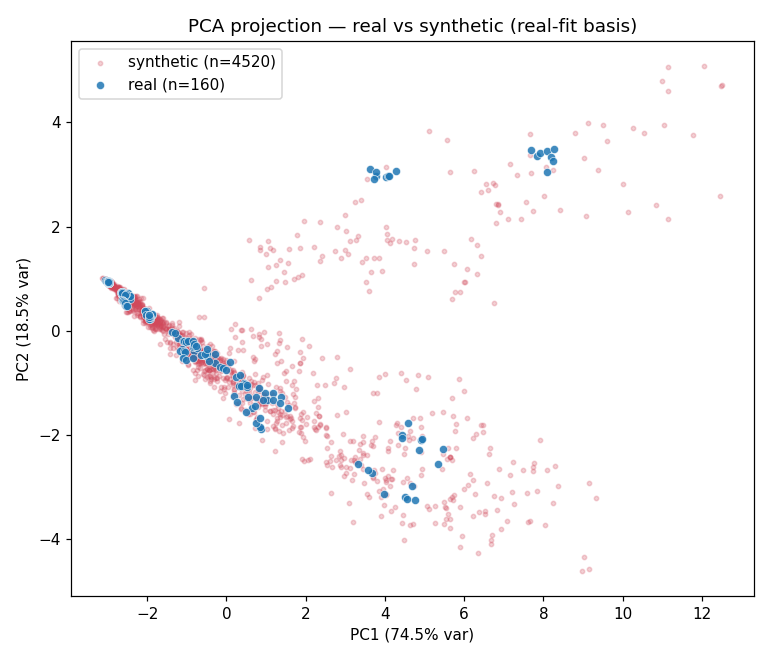

# MacroRisk AI — Phase 2 (Revised): Large-Scale Synthetic Financial Dataset

> ⚠️ **DEVELOPMENT ONLY.** This synthetic dataset is a temporary placeholder for pipeline development and validation. It is **not real data** and must not be used for production evaluation. Synthetic macro variables remain swappable for real history via `macro.provider`.

## 1. Generation method
- **Method:** `copula_temporal` — sector-conditional Gaussian copula over independent economic drivers, evolved across quarters with calibrated AR(1)/mean-reverting dynamics, reconstructed into financials via the accounting identities.

**Why this replaces the previous approach.** The earlier generator anchored each company to its sector's *median* ratios and perturbed ratios independently. That collapses marginal spread and destroys the joint dependence between features, so covariance/correlation are not preserved. A Gaussian copula instead reproduces (a) each driver's empirical marginal exactly and (b) the rank-dependence among drivers — so the reconstructed financials match the real marginals **and** correlation/covariance, while identities and quarterly dynamics are preserved by construction. It also scales to thousands of genuinely new company-quarters (each a fresh copula draw — no duplication or interpolation).

- **Companies generated:** 113 per sector × 5 sectors = 565 companies
- **Quarters per company:** 8 (real quarters only)
- **Total synthetic rows:** **4520**
- **Real reference rows:** 160

## 2. Automatic refinement loop
Generation repeats, shrinking temporal noise, until acceptance thresholds are met; the best-scoring iteration is kept.

| Iter | noise_scale | median KS | max KS | mean W/σ | corr MAE | score | accepted |
|--:|--:|--:|--:|--:|--:|--:|:--:|
| 1 | 1.000 | 0.0684 | 0.0800 | 0.1066 | 0.0595 | 0.2505 | ✅ |

- **Selected iteration:** 1 (noise_scale=1.000)

## 3. Acceptance verdict
**Overall: ✅ ACCEPTED**

| Metric | Value | Threshold | Pass |
|---|--:|--:|:--:|
| Median KS | 0.0684 | ≤ 0.15 | ✅ |
| Max KS | 0.0800 | ≤ 0.35 | ✅ |
| Mean Wasserstein/σ | 0.1066 | ≤ 0.25 | ✅ |
| Correlation MAE | 0.0595 | ≤ 0.1 | ✅ |

## 4. Per-feature distribution fidelity (KS & Wasserstein)
| Feature | KS stat | KS p-value | Wasserstein/σ |
|---|--:|--:|--:|
| Sales | 0.0702 | 0.4118 | 0.0734 |
| Expenses | 0.0607 | 0.5981 | 0.0720 |
| Operating Profit | 0.0611 | 0.5901 | 0.1089 |
| Net Profit | 0.0645 | 0.5202 | 0.1283 |
| Total Assets | 0.0670 | 0.4717 | 0.0969 |
| Equity | 0.0580 | 0.6537 | 0.0626 |
| Borrowings | 0.0800 | 0.2612 | 0.1547 |
| Total Liabilities | 0.0747 | 0.3372 | 0.1460 |
| CFO | 0.0657 | 0.4973 | 0.1172 |
| CFI | 0.0769 | 0.3039 | 0.0958 |
| CFF | 0.0749 | 0.3346 | 0.1081 |
| Net Cash Flow | 0.0698 | 0.4196 | 0.1152 |

## 5. Correlation & covariance structure
- Correlation MAE (off-diagonal): **0.0595**; max abs diff: 0.1901; Frobenius: 0.914
- Covariance (standardized) Frobenius: **0.9415**; max abs diff: 0.1951

## 6. PCA projection
- Explained variance (top 5 PCs, real basis): [0.7451, 0.1851, 0.0319, 0.0304, 0.005]
- PC1/PC2 spread — real: [2.99, 1.491], synthetic: [3.087, 1.375]
- Centroid distance (real vs synthetic) in PC1–PC2: **0.2511**

## 7. Target distribution fidelity (the six modelling targets)
| Target | KS | Wass/σ | real mean | synth mean | real median | synth median |
|---|--:|--:|--:|--:|--:|--:|
| Sales | 0.0702 | 0.0734 | 88,649.08 | 93,867.81 | 63,016.08 | 66,171.2 |
| Operating Profit | 0.0611 | 0.1089 | 15,171.37 | 16,154.92 | 14,787.42 | 14,977.18 |
| Net Profit | 0.0645 | 0.1283 | 11,327.12 | 12,150.57 | 11,301.6 | 11,107.98 |
| Borrowings | 0.0800 | 0.1547 | 282,369.68 | 208,227.19 | 75,823.71 | 75,041.92 |
| Total Assets | 0.0670 | 0.0969 | 630,488.02 | 623,601.19 | 259,006.78 | 255,597.0 |
| CFO | 0.0657 | 0.1172 | 21,635.5 | 23,026.34 | 16,348.3 | 16,746.4 |

## 8. Feature distribution comparison (moments)
| Feature | mean (real/synth) | std (real/synth) | median (real/synth) | skew (real/synth) |
|---|---|---|---|---|
| Sales | 88,649.08 / 93,867.81 | 72,366.12 / 77,283.63 | 63,016.08 / 66,171.2 | 1.103 / 1.13 |
| Expenses | 73,477.71 / 77,712.89 | 64,819.64 / 69,093.25 | 47,070.67 / 48,985.78 | 1.166 / 1.197 |
| Operating Profit | 15,171.37 / 16,154.92 | 9,340.01 / 10,388.84 | 14,787.42 / 14,977.18 | 0.645 / 0.94 |
| Net Profit | 11,327.12 / 12,150.57 | 6,980.41 / 8,107.08 | 11,301.6 / 11,107.98 | 0.653 / 1.07 |
| Total Assets | 630,488.02 / 623,601.19 | 886,091.67 / 922,789.63 | 259,006.78 / 255,597.0 | 2.129 / 2.882 |
| Equity | 285,716.45 / 286,235.14 | 388,739.53 / 405,429.06 | 125,704.4 / 118,896.43 | 2.116 / 2.614 |
| Borrowings | 282,369.68 / 208,227.19 | 565,316.16 / 380,930.64 | 75,823.71 / 75,041.92 | 2.756 / 3.921 |
| Total Liabilities | 417,989.78 / 337,366.04 | 738,802.04 / 533,117.16 | 129,503.39 / 133,271.15 | 2.585 / 3.325 |
| CFO | 21,635.5 / 23,026.34 | 18,219.99 / 20,636.66 | 16,348.3 / 16,746.4 | 1.283 / 1.612 |
| CFI | -12,387.8 / -13,117.18 | 10,400.01 / 11,893.27 | -9,862.2 / -9,358.9 | -1.287 / -1.763 |
| CFF | -4,489.15 / -4,867.74 | 3,917.45 / 4,665.4 | -3,422.97 / -3,435.34 | -1.355 / -1.888 |
| Net Cash Flow | 4,758.55 / 5,041.41 | 5,159.54 / 5,960.52 | 3,269.66 / 2,907.01 | 2.444 / 2.345 |

## 9. Sector & quarterly distributions
- Sector max %-gap (real vs synth): **0.0**
| Sector | real % | synth % |
|---|--:|--:|
| Auto | 20.0 | 20.0 |
| Banking | 20.0 | 20.0 |
| Energy | 20.0 | 20.0 |
| FMCG | 20.0 | 20.0 |
| Tech | 20.0 | 20.0 |

- Quarterly max %-gap (real vs synth): **0.0** (balanced across the 8 quarters by construction)

## 10. Conclusion
The synthetic dataset (4520 rows) meets the configured fidelity thresholds and preserves marginals, covariance, correlation, sector/quarter structure, temporal behaviour, and the accounting identities. **No models were trained.**

> ⚠️ **DEVELOPMENT ONLY.** This synthetic dataset is a temporary placeholder for pipeline development and validation. It is **not real data** and must not be used for production evaluation. Synthetic macro variables remain swappable for real history via `macro.provider`.
